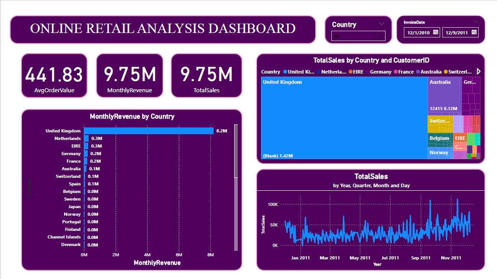

# Online_Retail_Dashboard
This is a transactional data set which contains all the transactions occurring between 01/12/2010 and 09/12/2011 for a UK-based and registered non-store online retail.The company mainly sells unique all-occasion gifts. Many customers of the company are wholesalers.performance across regions and categories.

# Power BI Dashboard: Online Retail Analysis

This repository contains a Power BI dashboard to analyze online retail performance across countries and various stock code

## Files
- **online retail analysis.pbix**: The Power BI dashboard file.
- **Online Retail.csv**: The dataset used to create the dashboard.
- **online retail analysis.pdf**: A screenshot of the dashboard.

## Requirements
- [Power BI Desktop](https://powerbi.microsoft.com/desktop/) to open the `.pbix` file.

## Preview

